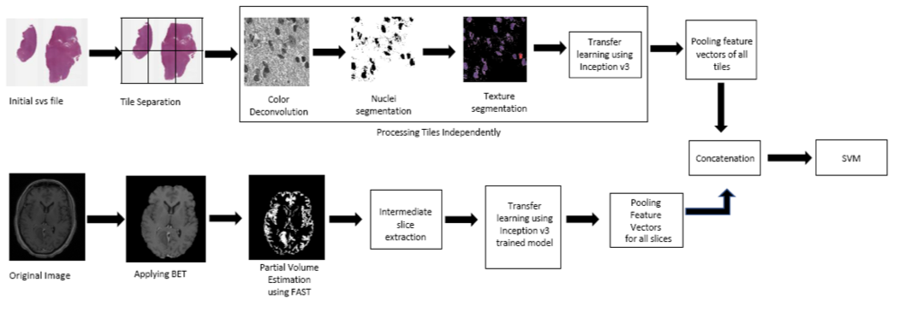

# COMBINED RADIOLOGY AND PATHOLOGY BASED CLASSIFICATION OF TUMOR TYPES
Computer Aided Detection plays a crucial role in the early detection of deadly diseases such as cancer (or) tumor. Pathology and radiology images form the core of tumor diagnosis. Pathology images provide clinical information about the tissues where as the radiology images can be used for locating the lesions.  This work aims at proposing a classification model which categorizes the tumor as oligodendroglioma (benign tumors) (or) astrocytoma (Malignant tumors). The architecture uses dedicated workflows for processing pathology and radiology images. 
 
   
                                <!  WORKFLOW FOR TUMOR CLASSIFICATION!>

# Files 

*tissue_percent.py*

  Eliminates the unuseful tiles using the features of the histogram
  Threshold value are computed directly from the histogram against which the intensity values are compared
  
  Performs color deconvolution to extract H image using Reinhard algorithm
  
  Segments the nuclei using Fuzzy means clustering provided in histomicstk package
  Features are extracted using ResNet50
  
 *SVM_Train.py*
 
  Creates an SVM model using Scikit-learn package
